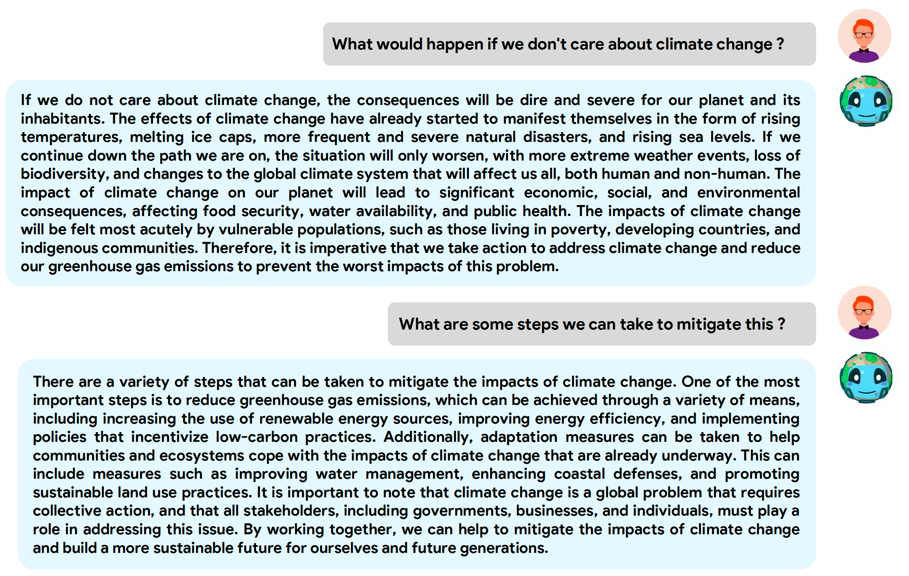
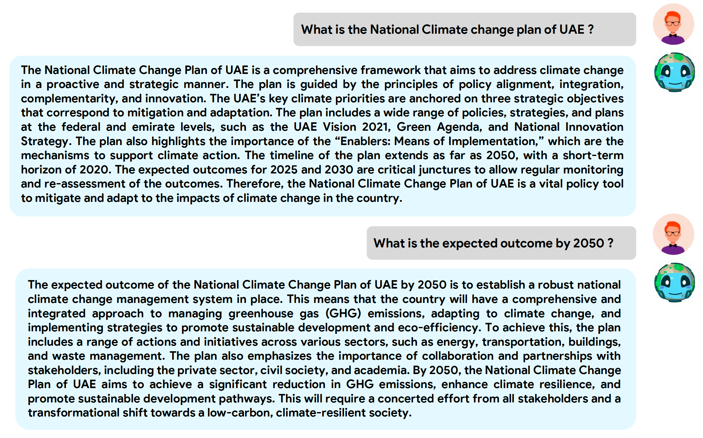
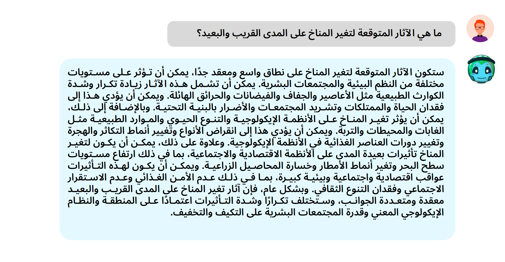
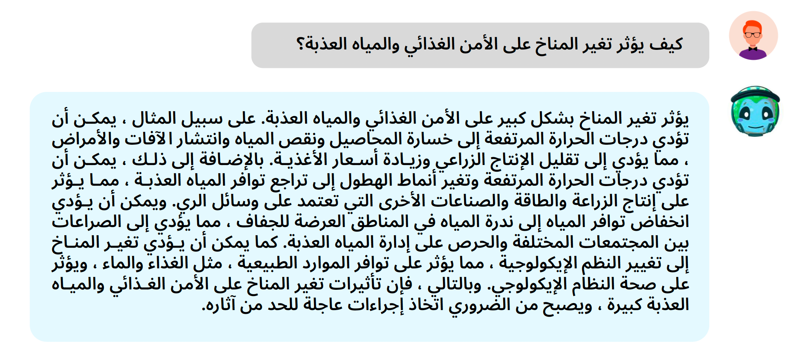

# ClimateGPT


[Sahal Shaji Mullappilly](https://scholar.google.com/citations?user=LJWxVpUAAAAJ&hl=en)* , [Abdelrahman Shaker](https://amshaker.github.io/)* , [Omkar Thawakar](https://omkarthawakar.github.io/)* , [Hisham Cholakkal](https://scholar.google.com/citations?hl=en&user=bZ3YBRcAAAAJ), [Rao Muhammad Anwer](https://scholar.google.com/citations?hl=en&authuser=1&user=_KlvMVoAAAAJ), [Salman Khan](https://salman-h-khan.github.io/), and [Fahad Shahbaz Khan](https://scholar.google.es/citations?user=zvaeYnUAAAAJ&hl=en). 

*Equal Contribution

**Mohamed bin Zayed University of Artificial Intelligence, UAE**


<a href='#'></a> [](https://youtu.be/2NKiujOJnqI) [](https://youtu.be/0CGb9jzxV1U)


## :rocket: News
<hr>

+ May-20 : Our code, models, and pre-processed datasets for English version are released. We will release everything related to the Arabic version as well as the technical report soon.


## Online Demo
You can try our demo using the following links :

[ClimateGPT](https://66e641bcc04d5483fb.gradio.live/).

[ClimateGPT (العربية)](https://6d405a1d9b82c92451.gradio.live/).


## About ClimateGPT
<hr>

+ ClimateGPT is a specialized Language Model (LLM) developed on top of Vicuna framework and fine-tuned specifically for Climate Change and Sustainability topics in both English and Arabic languages.
+ We introduce a vector embedding and datastore framework, which can be utilized during model inference for information retrieval without the need for additional training.
+ We have generated over 500k interactive conversational-style samples (Question & Answers) based on the [ClimaBench](https://arxiv.org/abs/2301.04253) and [CCMRC Climate Change](https://www.ijcai.org/proceedings/2022/729) datasets. This augmentation of interactive conversational data greatly enhances the performance of LLMs through the fine-tuning process. Our proposed dataset (Clima500) is available on [HuggingFace](https://huggingface.co/datasets/mbzuai-oryx/Clima500/tree/main). The instruction for Dataset creation will be released soon.
+ To the best of our knowledge, this marks the first release substantial conversational-style Arabic dataset (Question & Answers) dedicated to climate change and sustainability, comprising over 500k samples, dedicated to climate change and sustainability. The Arabic dataset will be released soon.


## Getting Started
### Installation

**1. Prepare the code and the environment**

Clone the repository and create a anaconda environment

```bash
git clone https://github.com/mbzuai-oryx/ClimateGPT.git
cd ClimateGPT
conda env create -f environment.yml
conda activate climateGPT
pip install -e .
```
OR 
```bash
git clone https://github.com/mbzuai-oryx/ClimateGPT.git
cd ClimateGPT
conda create -n climateGPT python=3.8
conda activate climateGPT
pip install -r requirements.txt
pip install -e .
```

### Setup

**1. Prepare the Datasets for training**

Download our Clima500 dataset from [here](https://huggingface.co/datasets/mbzuai-oryx/Clima500/tree/main) & our fine-tuned model checkpoint from [here](https://huggingface.co/mbzuai-oryx/ClimateGPT/tree/main).

**2. Prepare the pretrained Vicuna weights**

We built ClimateGPT on the v1.1 version of Vicuna-7B.
 
Refer the original repo for Vicuna-7B model weights [Vicuna-7B](https://github.com/lm-sys/FastChat#vicuna-7b)


### Training of ClimateGPT 

You can use the following command to train ClimateGPT with 4 x A100 (80GB).
```bash
torchrun --nproc_per_node=4 --master_port=20001 fastchat/train/train_mem.py \
    --model_name_or_path ~/path_to_model_weights/Vicuna-7B  \
    --data_path path_to_data/Clima500_en_train.json \
    --bf16 True \
    --output_dir output \
    --num_train_epochs 1 \
    --per_device_train_batch_size 2 \
    --per_device_eval_batch_size 2 \
    --gradient_accumulation_steps 16 \
    --evaluation_strategy "no" \
    --save_strategy "steps" \
    --save_steps 100 \
    --save_total_limit 1 \
    --learning_rate 2e-5 \
    --weight_decay 0. \
    --warmup_ratio 0.03 \
    --lr_scheduler_type "cosine" \
    --logging_steps 1 \
    --fsdp "full_shard auto_wrap" \
    --fsdp_transformer_layer_cls_to_wrap 'LlamaDecoderLayer' \
    --tf32 True \
    --model_max_length 2048 \
    --gradient_checkpointing True \
    --lazy_preprocess True
```

### Launching Demo (Web GUI) on local machine

Download the fine-tuned model checkpoint from [here](https://huggingface.co/mbzuai-oryx/ClimateGPT/tree/main).

Save the model checkpoint at `weights/ClimateGPT_en`

Run the following commands in separate Terminals : (see [web_run.sh](web_run.sh))

#### Launch the controller
```bash
python3 -m fastchat.serve.controller
```
#### Launch the model worker
```bash
python3 -m fastchat.serve.model_worker --model-path weights/ClimateGPT_en
```
#### Launch the Gradio Web server
```bash
python3 -m fastchat.serve.gradio_web_server
```

Refer [Gradio Web GUI](https://github.com/lm-sys/FastChat#serving-with-web-gui) for more information.

## Examples
  |   |   |
:-------------------------:|:-------------------------:
 |  
  |  


## Acknowledgement
<hr>

+ [Vicuna](https://github.com/lm-sys/FastChat) : The fantastic language ability of Vicuna is just amazing. And it is open-source!
+ [ChromaDB](https://github.com/chroma-core/chroma) : Chroma - the open-source embedding database.
+ [LangChain](https://github.com/hwchase17/langchain) : Building applications with LLMs through composability

## License
This repository is licensed under CC BY-NC-SA. Please refer to the license terms [here](https://creativecommons.org/licenses/by-nc-sa/4.0/).
